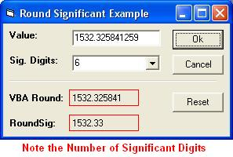



## Significant Rounding

### Description

This small project illustrates the concept of rounding numbers using significant digits. Unlike the Round function found in VB/VBA, which provides bankers rounding, this function provides the correct rounding of a number based on the number of significant digits needed. This basic concept is often over looked in scientific application development and is critical if your software is targeted to this audience. Take a look and provide some feedback&#8230; 29May05 - Fixed Bug with ComboBox.
 
### More Info
 

             |
---                |---
**Submitted On**   |2005-05-29 07:32:08
**By**             |[TerriTop](https://github.com/Planet-Source-Code/PSCIndex/blob/master/ByAuthor/territop.md)
**Level**          |Beginner
**User Rating**    |5.0 (20 globes from 4 users)
**Compatibility**  |VB 3\.0, VB 4\.0 \(16\-bit\), VB 4\.0 \(32\-bit\), VB 5\.0, VB 6\.0, VB Script, ASP \(Active Server Pages\) , VBA MS Access, VBA MS Excel
**Category**       |[Math/ Dates](https://github.com/Planet-Source-Code/PSCIndex/blob/master/ByCategory/math-dates__1-37.md)
**World**          |[Visual Basic](https://github.com/Planet-Source-Code/PSCIndex/blob/master/ByWorld/visual-basic.md)
**Archive File**   |[Significan1894165292005\.zip](https://github.com/Planet-Source-Code/territop-significant-rounding__1-60768/archive/master.zip)

